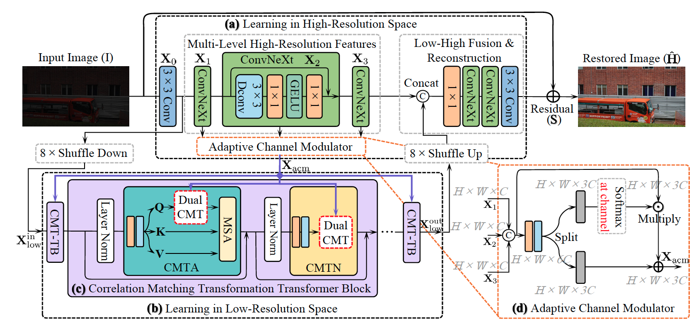
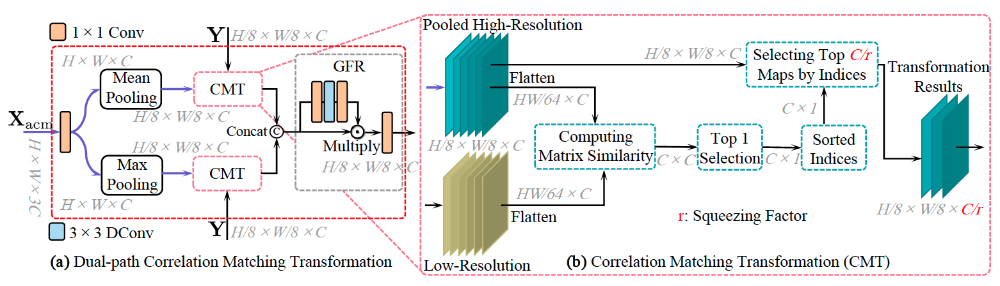
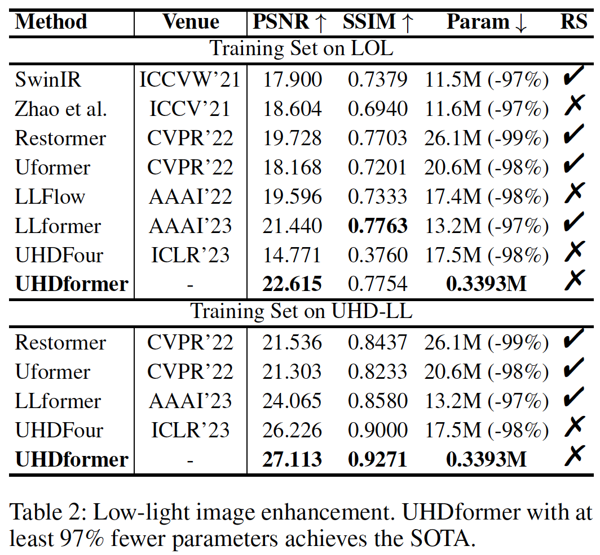
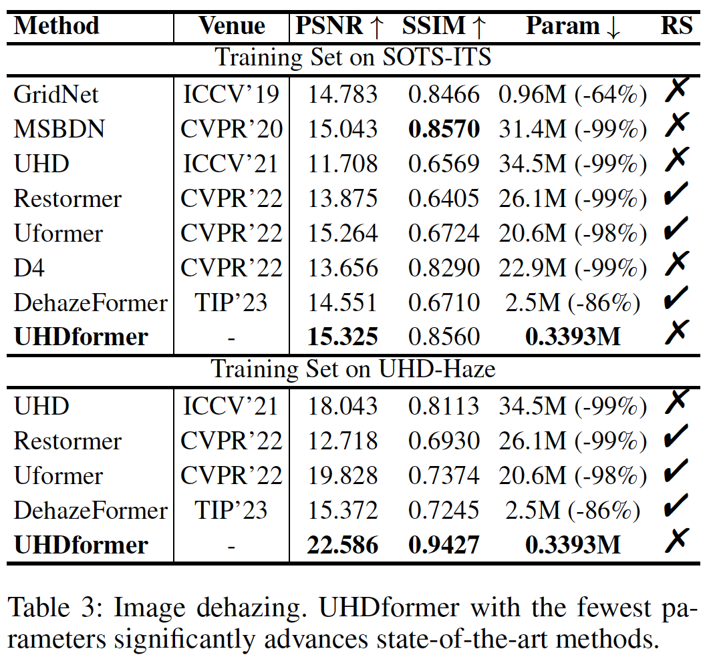
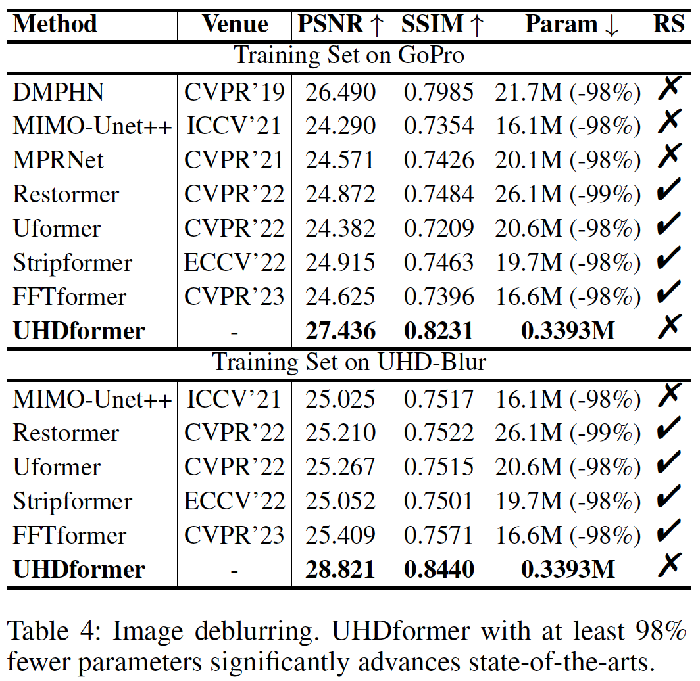

# UHDformer [AAAI-24]

This is the official PyTorch codes for the paper  
[Correlation Matching Transformation Transformers for UHD Image Restoration](https://ojs.aaai.org/index.php/AAAI/article/view/28341)  
[Cong Wang](https://scholar.google.com/citations?user=0DrHHRwAAAAJ&hl=zh-CN), [Jinshan Pan](https://jspan.github.io/), Wei Wang, [Gang Fu](https://scholar.google.com/citations?hl=zh-CN&user=2k1Hcd4AAAAJ), [Siyuan Liang](https://scholar.google.com/citations?hl=zh-CN&user=MLE3GekAAAAJ), Mengzhu Wang, [Xiao-Ming Wu](https://www4.comp.polyu.edu.hk/~csxmwu/), [Jun Liu](https://scholar.google.com/citations?hl=zh-CN&user=Q5Ild8UAAAAJ)

## Abstract
```
This paper proposes UHDformer, a general Transformer for Ultra-High-Definition (UHD) image restoration. 
UHDformer contains two learning spaces: (a) learning in high-resolution space and (b) learning in low-resolution space. 
The former learns multi-level high-resolution features and fuses low-high features and reconstructs the residual images, while the latter
explores more representative features learning from the highresolution ones to facilitate better restoration. 
To better improve feature representation in low-resolution space, we propose to build feature transformation from the high-resolution space to the low-resolution one. 
To that end, we propose two new modules: Dual-path Correlation Matching Transformation module (DualCMT) and Adaptive Channel Modulator (ACM). 
The DualCMT selects top C/r (r is greater or equal to 1 which controls the squeezing level) correlation channels
from the max-pooling/mean-pooling high-resolution features to replace low-resolution ones in Transformers, which can effectively
squeeze useless content to improve the feature representation in low-resolution space to facilitate better recovery. 
The ACM is exploited to adaptively modulate multi-level high-resolution features, enabling to provide more useful features to low-resolution space for better learning. 
Experimental results show that our UHDformer reduces about ninetyseven percent model sizes compared with most state-of-theart methods while significantly improving performance under different training sets on 3 UHD image restoration tasks, including
low-light image enhancement, image dehazing, and image deblurring.
```

## Overall of UHDformer


## Dual-path Correlation Matching Transformation


## Main Results

### Low-light Image Enhancement on UHD-LL


### Image Dehazing on UHD-Haze


### Image Deblurring on UHD-Blur


## Dependencies and Installation

- Ubuntu >= 18.04
- CUDA >= 11.0
- Other required packages in `requirements.txt`
```
# git clone this repository
git clone https://github.com/supersupercong/UHDformer.git
cd UHDformer 

# create new anaconda env
conda create -n uhdformer python=3.8
source activate uhdformer 

# install python dependencies
pip3 install -r requirements.txt
python setup.py develop
```

## Datasets Download

[UHD-LL](https://drive.google.com/drive/folders/1yJTf874-rrBfgxlmElkGoOYxmu7jZMh4?usp=sharing), [UHD-Haze](https://drive.google.com/drive/folders/1EAHC8UM3HwrI2O-AHFDXpoRRCsyXXUTz?usp=sharing), [UHD-Blur](https://drive.google.com/drive/folders/18kYF-Apj_KBXc6prO--xvN6zoMZ7r_8j?usp=sharing)

## Pre-trained Model

[UHD-LL](https://drive.google.com/drive/folders/1XwIWOjOepUA-kXoaeOlzMDijVK4LMj-1?usp=sharing), UHD-Haze [coming soon], UHD-Blur [coming soon]

## Visual Results

[UHD-LL&UHD-Haze&UHD-Blur&LOL-SOTS](https://drive.google.com/drive/folders/1ByOpu7l30VvWIE6Uv0Bm3l9gWc0eSRJs?usp=sharing)

### Train

```
bash train.sh
```

### Test

```
bash test.sh
```


## Citation
```
@inproceedings{wang2024uhdformer,
      author={Cong Wang and Jinshan Pan and Wei Wang and Gang Fu and Siyuan Liang and Mengzhu Wang and Xiao-Ming Wu and Jun Liu},
      title={Correlation Matching Transformation Transformers for UHD Image Restoration}, 
      year={2024},
      Journal = {Proceedings of the AAAI Conference on Artificial Intelligence (AAAI)},
}
```

## License

<a rel="license" href="http://creativecommons.org/licenses/by-nc-sa/4.0/"></a><br />This work is licensed under a <a rel="license" href="http://creativecommons.org/licenses/by-nc-sa/4.0/">Creative Commons Attribution-NonCommercial-ShareAlike 4.0 International License</a>.

## Contact

Any questions can contact: Cong Wang [supercong94@gmail.com]

## Acknowledgement

This project is based on [FeMaSR](https://github.com/chaofengc/FeMaSR).
